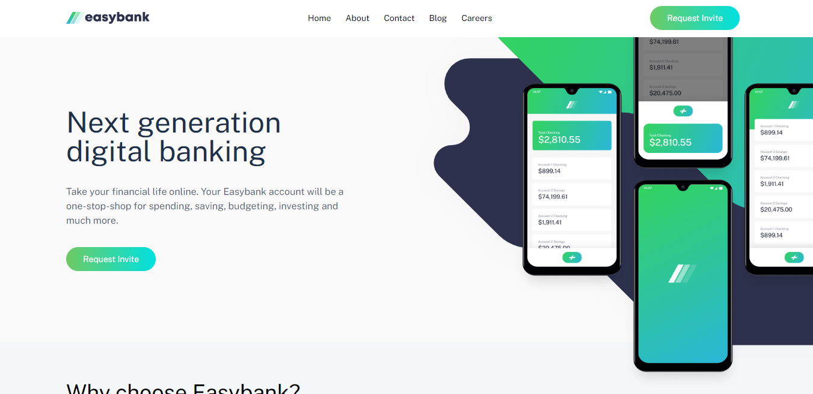

# Frontend Mentor - Easybank landing page solution

This is a solution to the [Easybank landing page challenge on Frontend Mentor](https://www.frontendmentor.io/challenges/easybank-landing-page-WaUhkoDN). Frontend Mentor challenges help you improve your coding skills by building realistic projects.

## Table of contents

- [Overview](#overview)
  - [The challenge](#the-challenge)
  - [Screenshot](#screenshot)
  - [Links](#links)
- [My process](#my-process)
  - [Built with](#built-with)
  - [What I learned](#what-i-learned)
  - [Continued development](#continued-development)
- [Author](#author)

## Overview

### The challenge

Users should be able to:

- View the optimal layout for the site depending on their device's screen size
- See hover states for all interactive elements on the page

### Screenshot

### Links

- Live Site URL: [Easybank](https://your-live-site-url.com)

## My process

### Built with

- ReactJS
- Tailwind
- Mobile-first workflow
- [React](https://reactjs.org/) - JS library
- [Tailwind](https://tailwindcss.com/) - CSS Framework

### What I learned

In this project, I learnt how to manage images and especially background images. I also learnt how to make a website responsive

To see how you can add code snippets, see below:

### Continued development

I am still not an expert with responsive designs. I want to learn how to create responsive websites with as less code as possible

## Author

- Website - [Ibn Naseer](https://ibn-naseer.vercel.app/)
- Frontend Mentor - [@yourusername](https://www.frontendmentor.io/profile/yourusername)
- Twitter - [@AliBinTweets](https://twitter.com/AliBinTweetse)
